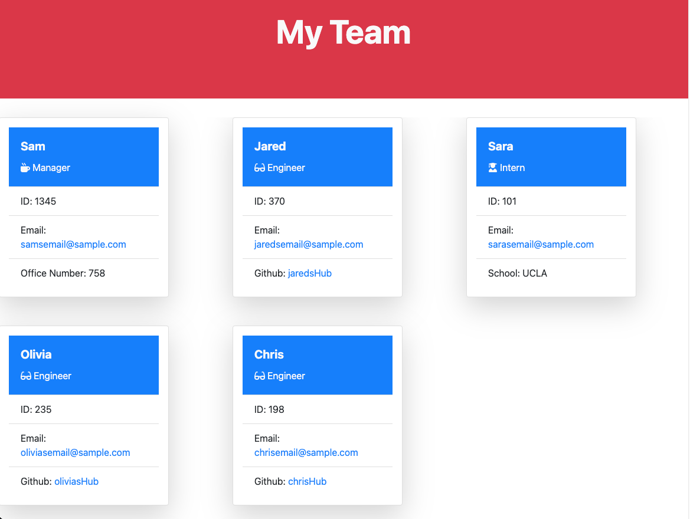
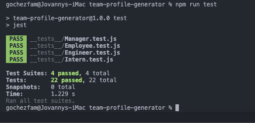

# Team Profile Generator

# Table of Contents

- [Description](#description)
- [Installation](#installation)
- [Technologies](#technologies)
- [Repository](#repository)
- [Questions](#questions)
- [License](#license)

  # Description

  - This project allows a manager to generate a webpage that displays their team's basic information so that they can have quick access to their emails and Github profiles.

  # Installation

  - In order to use this project, please make sure that you have Node downloaded onto your machine. If you need help downloading Node, you can download Node on their webpage here: https://nodejs.org/en/download/. Then run the command `node index` and answer the question prompts to create your team's web page.

  # Technologies

  - Node.js
  - JavaScript
  - Jest
  - HTML
  - Bootstrap

# Images
 ### Example of a Team's Profile made with this generator:

### Screenshot of passing tests through Jest:

### Live Video Demonstration of how the profile is generated:

[Walk-through Video Link Here!](https://drive.google.com/file/d/1mIaG1M1OuIeO3JRJjJdcX5lJPYGknHr3/view)

# Repository

- <a href="https://github.com/saraoros">Github Repository</a>

# Questions
### Have an questions? Feel free to reach out to me via email: 
- saragochez13@gmail.com

# License

  
Copyright © 2022

    Permission is hereby granted, free of charge, to any person obtaining a copy of this software and associated documentation files (the "Software"), to deal in the Software without restriction, including without limitation the rights to use, copy, modify, merge, publish, distribute, sublicense, and/or sell copies of the Software, and to permit persons to whom the Software is furnished to do so, subject to the following conditions:

    The above copyright notice and this permission notice shall be included in all copies or substantial portions of the Software.

    THE SOFTWARE IS PROVIDED "AS IS", WITHOUT WARRANTY OF ANY KIND, EXPRESS OR IMPLIED, INCLUDING BUT NOT LIMITED TO THE WARRANTIES OF MERCHANTABILITY, FITNESS FOR A PARTICULAR PURPOSE AND NONINFRINGEMENT. IN NO EVENT SHALL THE AUTHORS OR COPYRIGHT HOLDERS BE LIABLE FOR ANY CLAIM, DAMAGES OR OTHER LIABILITY, WHETHER IN AN ACTION OF CONTRACT, TORT OR OTHERWISE, ARISING FROM, OUT OF OR IN CONNECTION WITH THE SOFTWARE OR THE USE OR OTHER DEALINGS IN THE SOFTWARE.
